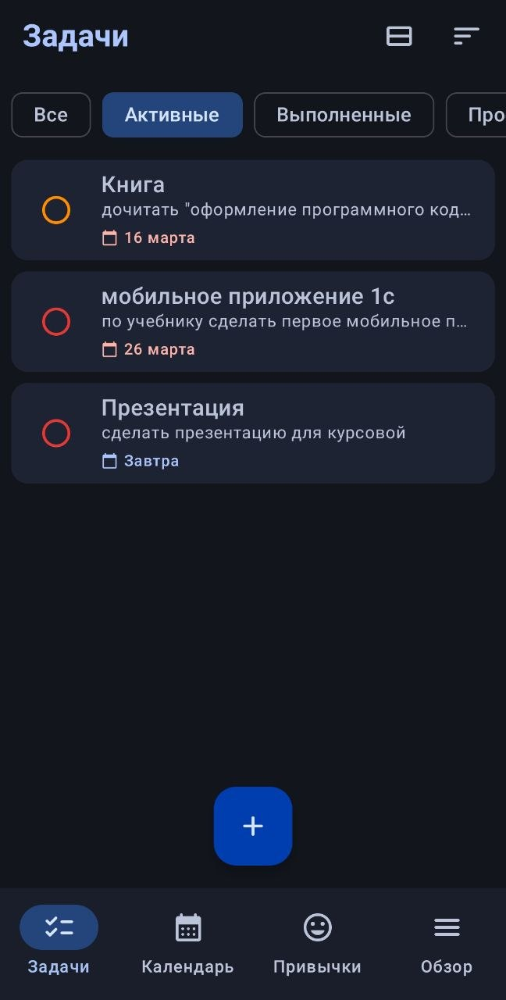
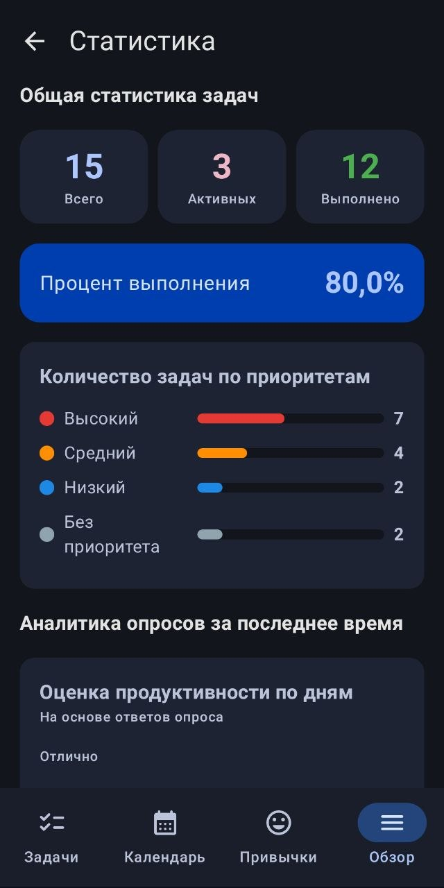
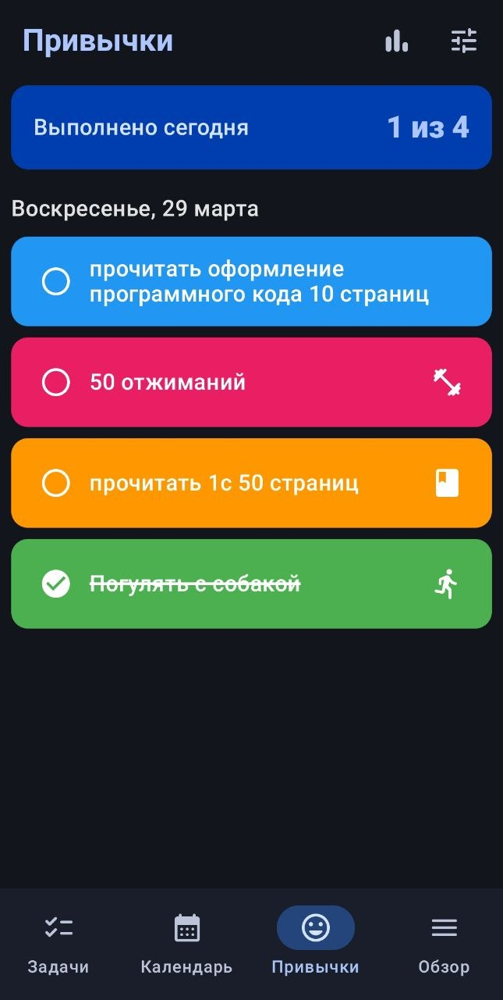
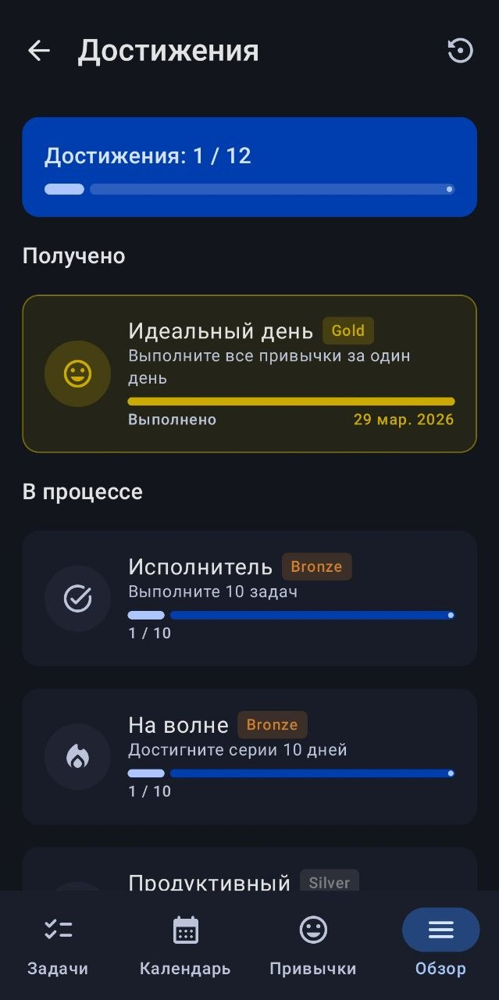
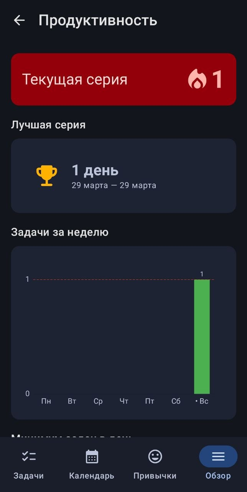
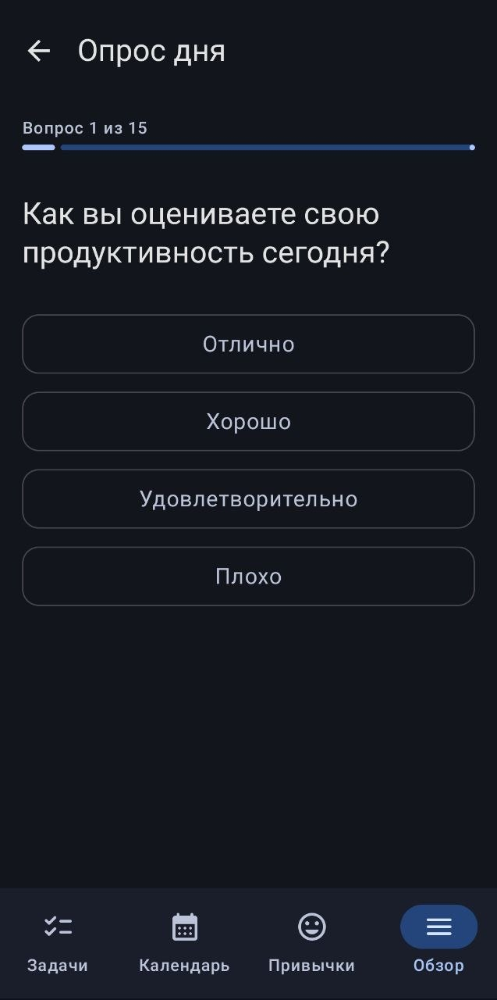
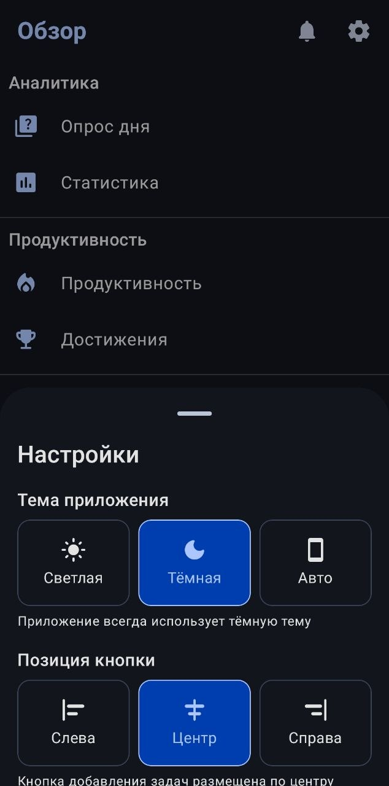

# TaskManagerAndroid

> Мобильное приложение для управления задачами на платформе Android

## 📋 О приложении

Task Manager — это мобильное приложение-планировщик для платформы Android.

Приложение позволяет пользователю создавать задачи, отслеживать их
выполнение, анализировать личную продуктивность и формировать
полезные привычки.

## ✨ Функциональность

### Управление задачами
- Создание, редактирование и удаление задач
- Установка дедлайна (дата и время)
- Четыре уровня приоритета
- Три статуса: «Сделать», «В работе», «Готово»

### Фильтрация и поиск
- Фильтрация по статусу и приоритету
- Задачи по календарю
- Просроченные задачи

### Аналитика
- Процент выполненных задач
- Распределение по статусам и приоритетам
- График продуктивности за период по разным характеристикам

### Модуль привычек
- Создание ежедневных привычек
- Выбор дней недели для выполнения
- Журнал выполнения по дням
- Иконка и цвет для каждой привычки

### Интерфейс
- Светлая и тёмная тема
- Сортировка и группировка списка задач

## 🛠 Стек технологий

| Технология      | Назначение                    |
|-----------------|-------------------------------|
| Kotlin          | Основной язык разработки      |
| Jetpack Compose | Декларативный UI              |
| Room + SQLite   | Локальная база данных         |
| Hilt            | Внедрение зависимостей        |
| Kotlin Flow     | Реактивные потоки данных      |
| DataStore       | Хранение настроек отображения |
| Migrations      | Миграция баз данных           |
| Git + GitHub    | Контроль версий               |

## 🗃 База данных

База данных **Room ** содержит 5 таблиц:

| Таблица | Описание                   |
|---------|----------------------------|
| `tasks` | Задачи пользователя        |
| `habits` | Привычки пользователя      |
| `habit_logs` | Журнал выполнения привычек |
| `survey_results` | Результаты опросов         |
| `achievement_progress` | Прогресс достижений        |

## 📥 Установка

1. Перейди в раздел [Releases](../../releases)
2. Скачай файл `app-release.apk`
3. На Android-устройстве разреши установку из неизвестных источников:
   **Настройки → Безопасность → Установка неизвестных приложений**
4. Открой скачанный файл и установи приложение

## 👥 Команда

| Участник              | Роль |
|-----------------------|------|
| Chaykaman             | Архитектура данных, БД, DAO, репозитории, DI |
| yaluknov              | UI, навигация, экраны задач |
| aiui338 | Аналитика, достижения |

## 📱 Скриншоты

Главное меню

Просмотр задач по календарю

Страница привычек

Обзор

Достижения

Статистика

Серии выполнения

Опрос

Тема оформления

